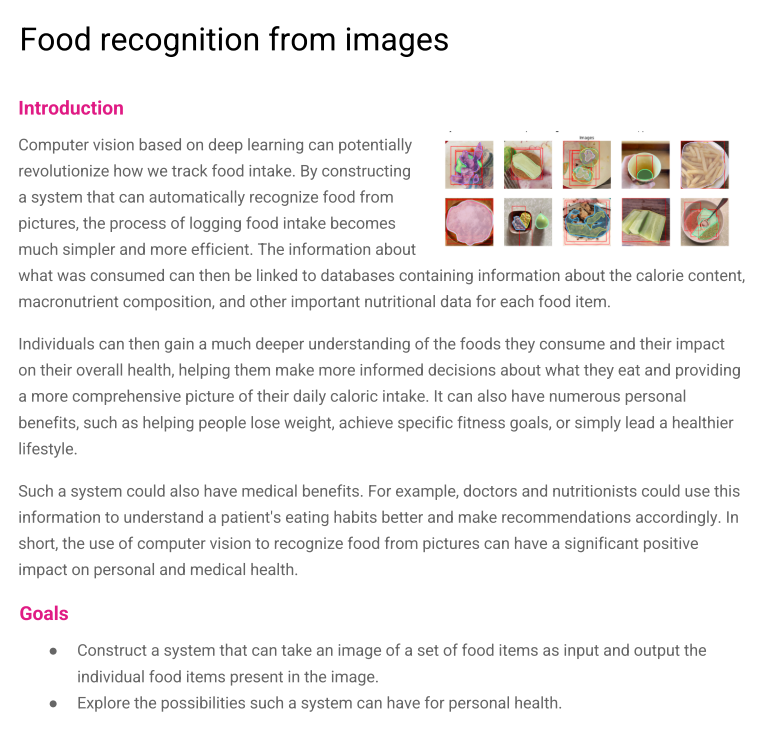

# Food Recognition

[deployed application](https://huggingface.co/spaces/h602117/YOLO-Food-Nutrition)

## Overview

This repository contains the results from our course project in Deep Learning
Engineering (DAT255) at Western Norway University of Applied Sciences (HVL).
From many options we chose to focus on building a model for detecting food
items in an image. Part of the assignment is to take a look at how deep
learning can be used to solve real life problems. For this part of the
assignment we chose to focus on how we could use this to automatically get
nutritional values from images of food. This can be beneficial for helping
people easily get information about the food that they eat, for example people 
on a thight diet because of health reasons, athletes etc. These are some examples
of people that need to track every micro- and macro-nutrient which would benefit
from a application like this. Situations like resturants where a person will
not be able to controll the portion of the food they are eating will be .

## The Assignment

## Dataset

The dataset consists of images of food items annotated in the coco-format. The
annotations have labels, segmentation masks, and bounding boxes for the images.
The dataset can be found [here](https://www.aicrowd.com/challenges/food-recognition-benchmark-2022/dataset_files)
and consists of these:

- public_training_set_release_2.1.tar.gz: Training Set of 54,392 food images, along with their corresponding 100,256 annotations from 323 food classes in MS-COCO format
- public_validation_set_2.1.tar.gz: Validation Set of 946 food images, along with their corresponding 1708 annotations from 323 food classes in MS-COCO format
- public_test_release_2.1.tar.gz: Test Set for Food Recognition Benchmark 2022.

## Training a model

Throughout the project we tried many different approaches to the problem. Some
of them worked better than others. Some of our failed attempts can be found in
the folder `failed_attempts`. Some of the different approaches will be described
below.

### Segmentation

The first approach was using the segmentation data in the dataset to create
masks for the images and train a model to recognize the shape of food items. As
we also needed to classify the food items this got quite complicated, and we did
not get far with this. To reach our goal we decided to try something different.

### Object detection

Another way the group looked at solving the problem was by object detection using
fast.ai and boundingboxes. For this the group took inspiration from
[johnrobinsn](https://github.com/johnrobinsn/ObjectDetectionNotebooks/tree/main/nbs)
which gives a step-by-step guide of how to build a object detection model from 
scratch. This guide also shows how to make the model detect multiple objects in
the same image. However when trying to implement this, the group ran into 
dependency issues with the miniai library used. Because of this the group looked
at [dhblog](https://dienhoa.github.io/dhblog/posts/SSD_base.html) to try to 
implement a model that would be able to detect multiple objects in the same image.
Unfortunately the group ran into problems with the dataset and ended up scrapping
this version. From this experience the group decided to focus on single object
detection, and were able to create a model that predicts the bounding box of
the largest object in an image along with it's object class. This work can be found
in `./foodrecognition-objectdetection.ipynb`.

### Multi-label classification

As a further simplification the group looked into creating a multi-label
classification model. This type of model would also help us achieve our goals,
as it can be used to determine what food items are present in an image, just
not where they are. This approach did not require creating a custom model, like
some of the above, and could be done with just functionality built into fast.ai.

At first our classification model did not work that well. After some
investigation we concluded that this was because of the many overly specific
categories in the dataset. After cleaning up the dataset, by removing some of
the too specific categories and combining some overlapping categories into one,
the model got a lot better. Look to `./multi-label-classification-food.ipynb`
for this approach.

### Pretrained alternative

While most of out time working on this project was spent trying to make our own
model to recognize food items, we also used some time exploring models made by
others. We looked at YOLOv8 from [ultralytics](https://docs.ultralytics.com/),
a model which is at the cutting-edge of deep learning and computer vision. We
used a pretrained YOLO model and built a gradio app around it. This expermient
can be found in the `yolo-experiment` folder in this repository. This model
obviously worked at lot better than the ones we have manage to train ourselves,
and gives us some perspective into how the best of the best can be used. We
combined this model with a nutrition API. That way our application both
recognized what food items was in the image, and the nutritional values of the
food items. The application made with this model is hosted on
[huggingface spaces](https://huggingface.co/spaces/h602117/YOLO-Food-Nutrition)
(output images from this model have a blue tint for some reason unknown to us...)

### Conclusion

Throughout this project the group has tried to solve the problem in a few
different ways, and while each one has different success rate, the main
goal for the group was to get a better understanding of core deep learning
concepts. While the course that this project is a part of focuses on fast.ai,
the group decided to explore other libraries and methods like using tensorflow 
and keras. However these attempts were not successful, it helped the group to
get a better understanding of the dataset used for the project and how to solve
the problem. 

While far from perfect the group had some success, with single
object detection and multi-label classification. The model for single object
detection is not perfect, as many of the pictures contain multiple items,
which this model does not take into account. It also strugles with the more
complex categories of food like for example "pizza_margherita_baked" where the
model predicts that the item in the picture is a pizza. While an accuracy of
around 50% might not seem like the best result, taking the amount of classes
in the dataset into account, where some are extremely specific, the result is
not too bad.

For multi-label classification we got some okay results after a while. We had
some issues along the way, but in the end we got a model that is capable of
recognizing food items in images.

Our models would need some more work to be useful in any real world context, but
as a proof of concept and a learning exercise we are happy with what we achieved
during this project.

Hopefully this repository, with its resources, will be of assistance for other
people that are trying to solve this challenge.
